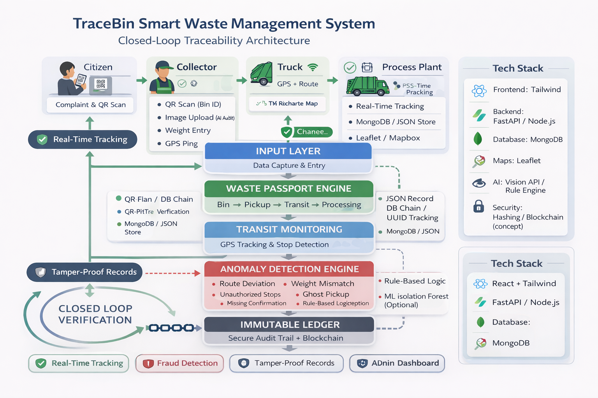

# 🚮 TraceBin

### Smart Waste Traceability for Transparent Cities

> Transforming waste management into a **transparent, accountable, and intelligent system**.

---

## 📌 Overview

TraceBin is a smart waste accountability platform that tracks waste from **bin to processing plant** using real-time monitoring, anomaly detection, and tamper-proof records.

It eliminates the “black box” in waste management by ensuring **complete visibility and verification at every stage**.

---

## ❗ Problem Statement

* No tracking once waste leaves households
* High risk of illegal dumping & fraud
* No real-time monitoring of collection vehicles
* Lack of accountability & audit trails
* Environmental and public health risks

---

## 💡 Solution

TraceBin introduces a **Waste Passport System** that:

* Tracks waste lifecycle (Bin → Pickup → Transit → Processing)
* Monitors vehicles in real-time
* Detects anomalies like route deviation & weight mismatch
* Stores tamper-proof audit logs
* Provides a centralized dashboard for authorities

---

## 🎥 Demo Video

https://github.com/user-attachments/assets/46e4ce7c-c062-4b29-9807-48bf65f00359

---

## 🏗️ System Architecture

* Input Layer (Citizen, Collector, Plant)
* Waste Passport Engine
* Transit Monitoring (GPS Tracking)
* Anomaly Detection Engine
* Immutable Ledger
* Admin Dashboard

## system architecture

  

---

## 🔑 Key Features

* 📍 Real-time GPS tracking
* 🚨 Fraud & anomaly detection
* 🔐 Tamper-proof audit system
* 📊 Centralized monitoring dashboard
* 👥 Citizen participation (QR-based tracking)

---

## 🛠️ Tech Stack

### Frontend

* React.js (Vite)
* Tailwind CSS
* Framer Motion

### Backend

* FastAPI (Python) / Node.js (Express)
* REST APIs

### Database

* MongoDB

### Maps & Tracking

* React Leaflet (OpenStreetMap)

### AI & Analytics

* Rule-based anomaly detection
  
---

## 🔄 How It Works

1. Citizen scans QR / uploads waste data
2. Collector verifies pickup with GPS & image
3. System tracks truck movement in real-time
4. Anomaly engine detects fraud or irregularities
5. Plant verifies final waste processing
6. All data stored in secure audit logs

---

## 📈 Impact & Benefits

* 🌍 Reduced environmental pollution
* 💰 Prevention of financial fraud
* 🔍 Increased transparency & accountability
* 🚨 Real-time governance & alerts
* 👥 Improved citizen trust

---

## 🚀 Future Scope

* Integration with smart IoT bins
* AI-based waste classification
* Blockchain-based audit system
* Deployment in smart cities

---

## 🧠 Innovation Highlight

> “We are not just managing waste — we are managing accountability.”

---

## 👨‍💻 Team

* HackQueen

---

